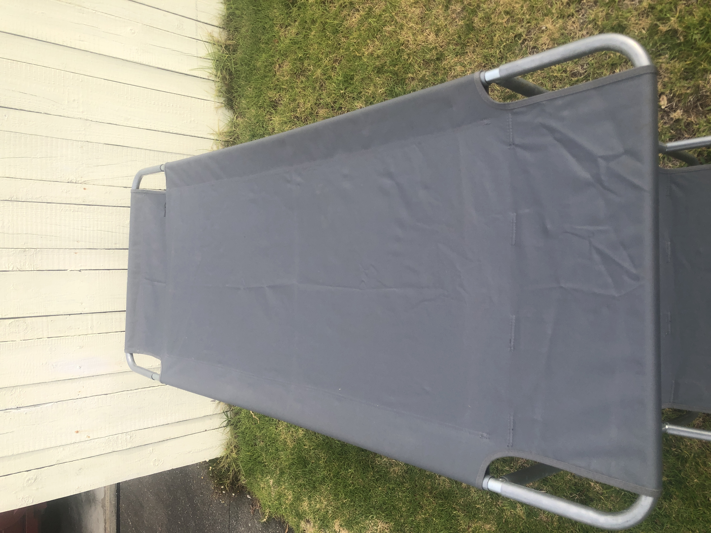

Given that I could not find this on the internet, I thought I would make my own set of instructions.

::: {.callout-warning title="Disclaimer"}
I am not affiliated with Kathmandu or Basecamp. I cannot guarantee the accuracy of these instructions.
:::

The set is easy enough to put together once you understand how, and should only take about 15 minutes.

It is best to refer to the three pictures to understand it. The bed can be made either as two single beds or one set of bunks.

## Parts

::: {.callout-note title="Photo Note"}
In the photos I made it slightly wrong by using P2 for the lengthwise sides of the beds, which means the bunk set is slightly taller and slightly shorter.
:::

| item name | description | count |
| --- | --- | --- |
| P1 | Long bar with female (wide) at each end, used for length sides of each bed | 4 |
| P2 | Short bar with female at each end, used to hold the top bunk above the bottom bunk | 4 |
| P3 | Long bar with female at one end and male at the other end, used for length sides of each bed | 4 |
| C1 | Connector that is used on the corners for the bottom bunk | 4 |
| C2 | Connector that is used on the corners of the top bunk | 6 |
| C3 | Curved bar that is used for the end of the bed and as the legs of the bottom bunk (and second bed if having two singles) | 8 |

## Step by step

See photo below for the complete setup. From here you might already be able to tell how to put it together. More detailed instructions below.

### Make top bunk
1. Connect P3 and P1 and thread them through lengthwise on the side of the bed; do this for both sides.
2. Thread C3 through the end (marked "start here").
3. Connect C3 to a C2 and then to the P3/P1 bar
4. On the other end of the bed, connect C2 and then a C3.
5. Now you need to pull the flap up and over the bar, which will pull the fabric tight lengthwise.
Now you have completed the top bunk. If you want two singles, simply repeat this with the other bed and then add legs.

### Making bottom bunk
1. To make the bottom bunk do the same steps as above except use C1 instead of C2. 
2. Put the legs on the bottom of the bed.
3. Put P2 in the 4 vertical top holes of C1 of the bottom bunk.
4. Place the top bunk on top.

To make two single beds, use the spare parts as shown below:

