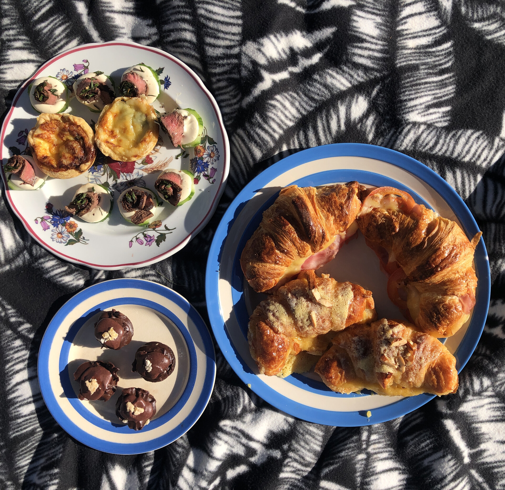
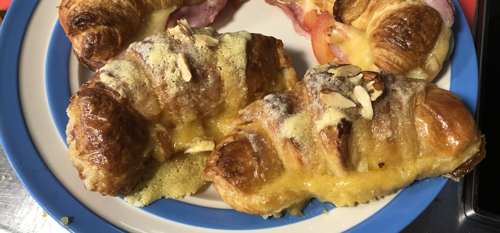
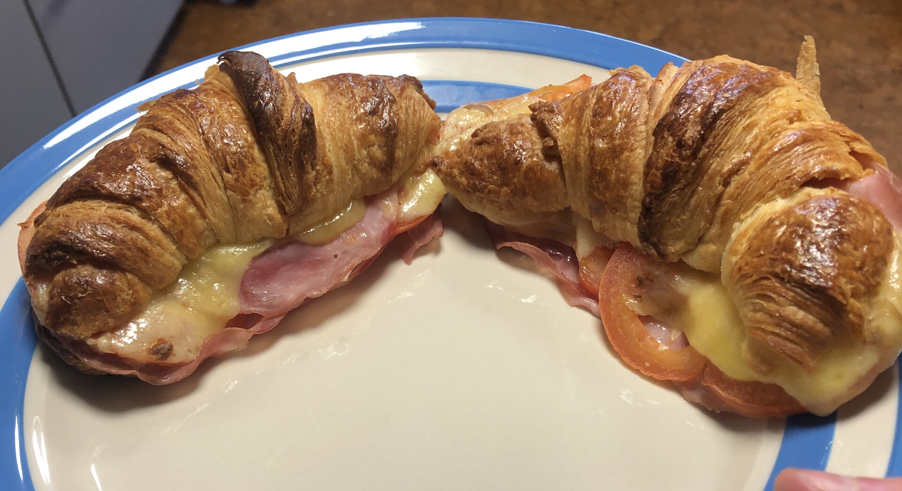
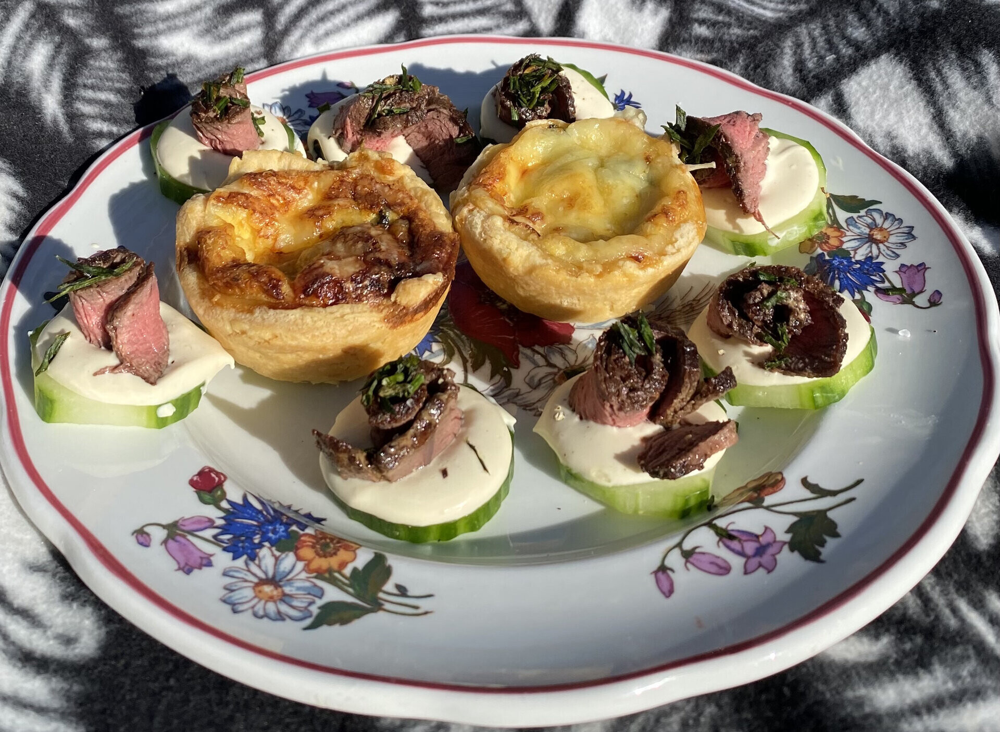
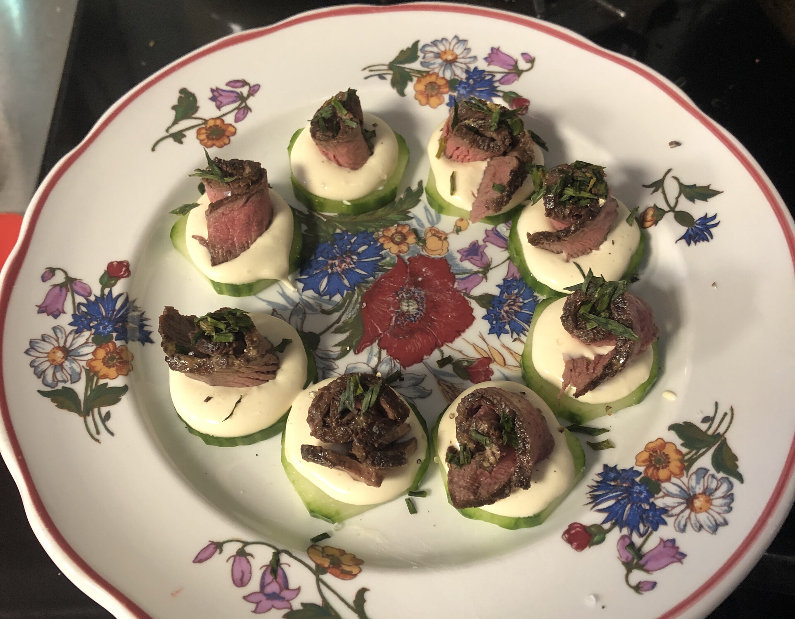
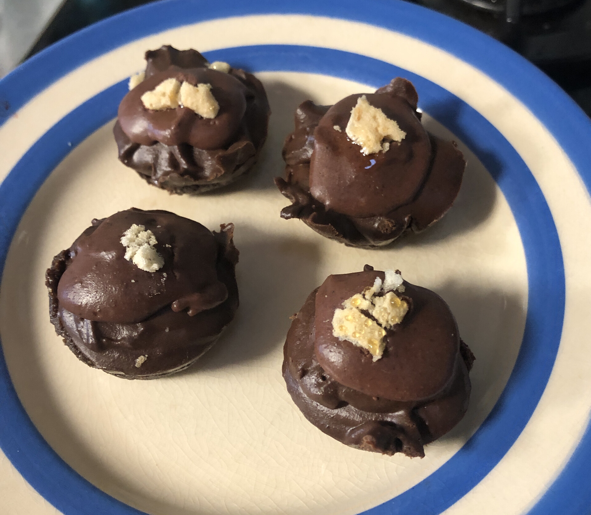
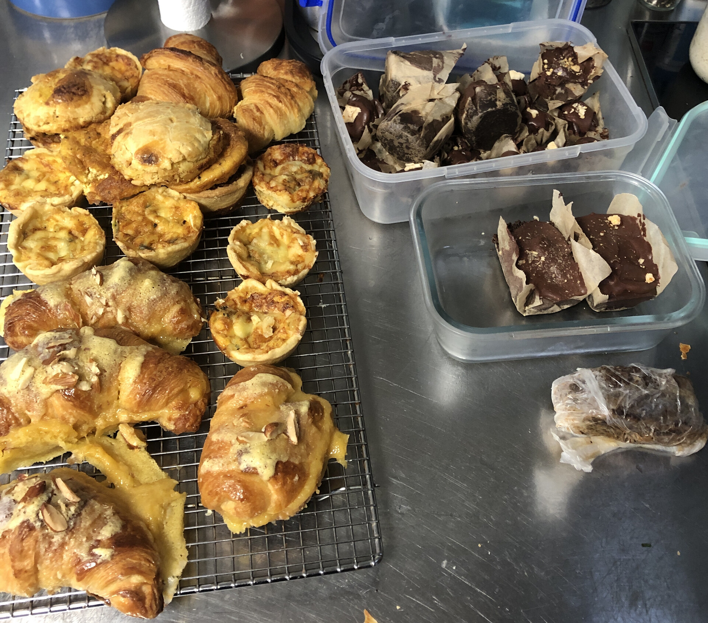

I am quite busy right now. Finishing up some work on a [Applied AI project](https://github.com/1jamesthompson1/TAIC-engine) and starting work on my Master's research project^[One page summary on the way!]. Which is exactly the reason I have been in the kitchen cooking more so than ever before. There seems to be a strong correlation between how busy I am and how much I cook...

## The idea to make high tea

I had a really great idea last month that for me and my partners date day I should make high tea. The reason for this idea being so splendied is simple:

1. Me and my partner enjoy eating yummy high tea food (which to us just means yummy food).  
2. I enjoy cooking and making food for my partner.  

As a bonus it is a good exuse to get to cook the complex, yummy food that I can't normally fit in my weekly schedule. Now I am no chef, but I do enjoy cooking and in the past year have let the rabit out the bag so to speak and cook alot more (with great success thanks to AI support).

## The rules

To keep myself grounded the rules are simple  
- 3 savoury items and 2 sweet items.  
- No repeats of a food item made in any previous high teas I have made (which will be more of a challenge as time goes on yet should prevent any mode collapse).  
- All made from scratch (as much as reasonably possible^[This roughly coincides with as raw as possible and no [ultra processed foods](https://en.wikipedia.org/wiki/Nova_classification#Group_4:_Ultra-processed_foods).]).

## What I did

What you will find below is a list of the food I made for our high tea with pictures and recipes. Most of the recipes are made with great assistance from ChatGPT with tweaks and what not to make it all work. They all worked well enough for me to enjoy yet by no means are they perfect, and furthermore by no means are they 'accurate' or 'correct' recipes.

It probably took about a day of cooking spread out over 4 days. The most complex thing were the croissants (due to all of the folding and rolling out by hand) and the raw chocolate cheesecake (making bean-to-bar chocolate at home is tough!).

The five things that I made for our high tea were:
- Savoury:
  - [Mini spinach and gruyere quiche](#mini-spinach-and-gruyere-quiche)
  - [Seared Beef, horseradish cream on cucumber](#seared-beef-horseradish-cream-on-cucumber)
  - [Ham and Cheese croissants](#ham-and-cheese-croissants)
- Sweet:
  - [Almond croissants](#almond-croissants)
  - [Raw chocolate cheesecake](#raw-chocolate-cheesecake).
  

# The food

## Croissants

There were two types of croissant items I made. A sweet and a savoury. Both however were made from the same butter croissant bases (cooked the day before).

[Butter croissant recipe](recipes/butter-croissants.pdf)

### Almond croissants

The real reason for croissants was to make almond croissants. This is the third time I have attempted and the first time they come out close enough to croissants to be considered a success.

[Almond croissant recipe](recipes/almond-croissants.pdf)

### Ham and Cheese croissants

Being a Kiwi I have no idea what the french themselves think of a ham and cheese croissant, but to me they are a bit like the pie of France. So hearty and good.

[Ham and Cheese croissant recipe](recipes/ham&cheese-croissants.pdf)

## Mini spinach and gruyere quiche

Only ended up eating couple with high tea, yet were quite good with the swiss style cheese. Many more for leftovers.

[Spinach and gruyere quiche recipe](recipes/spinach&gruyere-quiches.pdf)

## Seared Beef, horseradish cream on cucumber

[Seared beef tenderloin canapes recipe](recipes/seared-beef-tenderloin-canapes-with-horseradish-cream&cucumbers.pdf)

## Raw chocolate cheesecake

These took longer than one might think as I made the chocolate myself. However 

[Raw chocolate cheesecake recipe](recipes/raw-chocolate-cheesecake.pdf)

# The leftovers

A trouble with making high tea for two is that you end up making alot of food and only eating a little. Luckily with teh power of modern technology (i.e refridgerators) we simply have lunch sorted for days!

Lets see now how long I can keep this up for. I am thinking once a month is a good start.