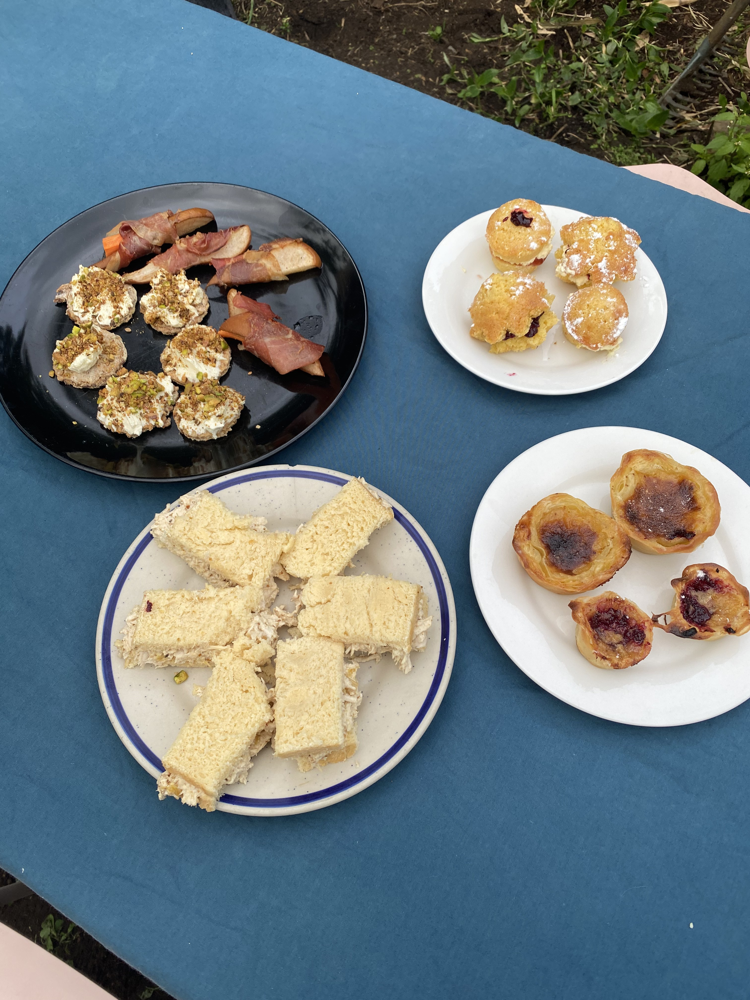
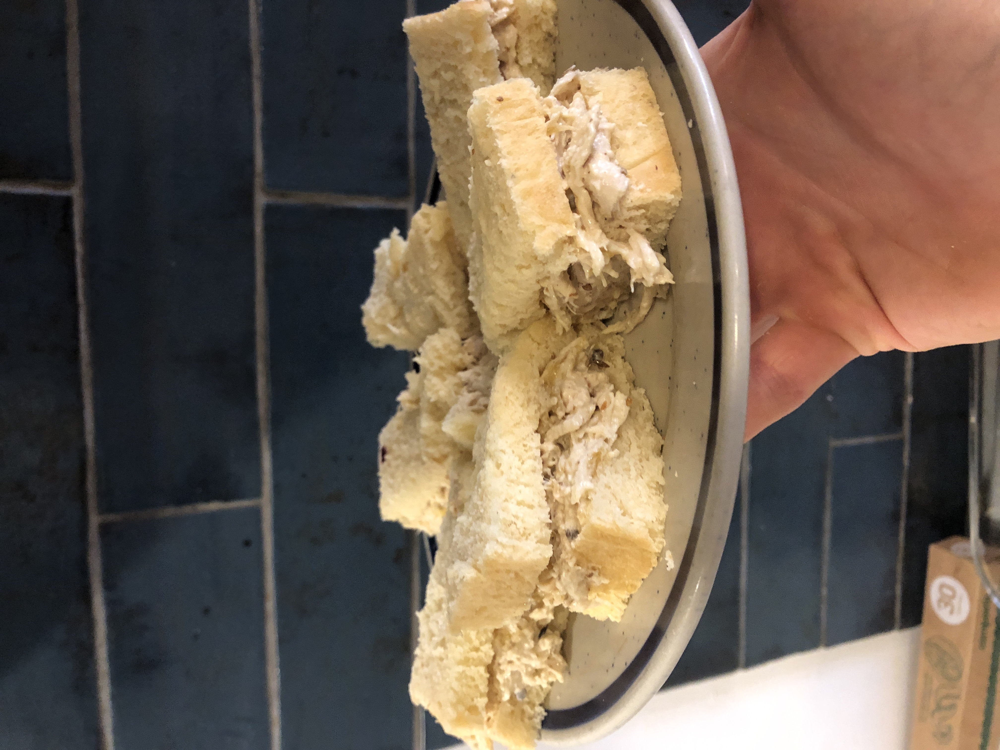
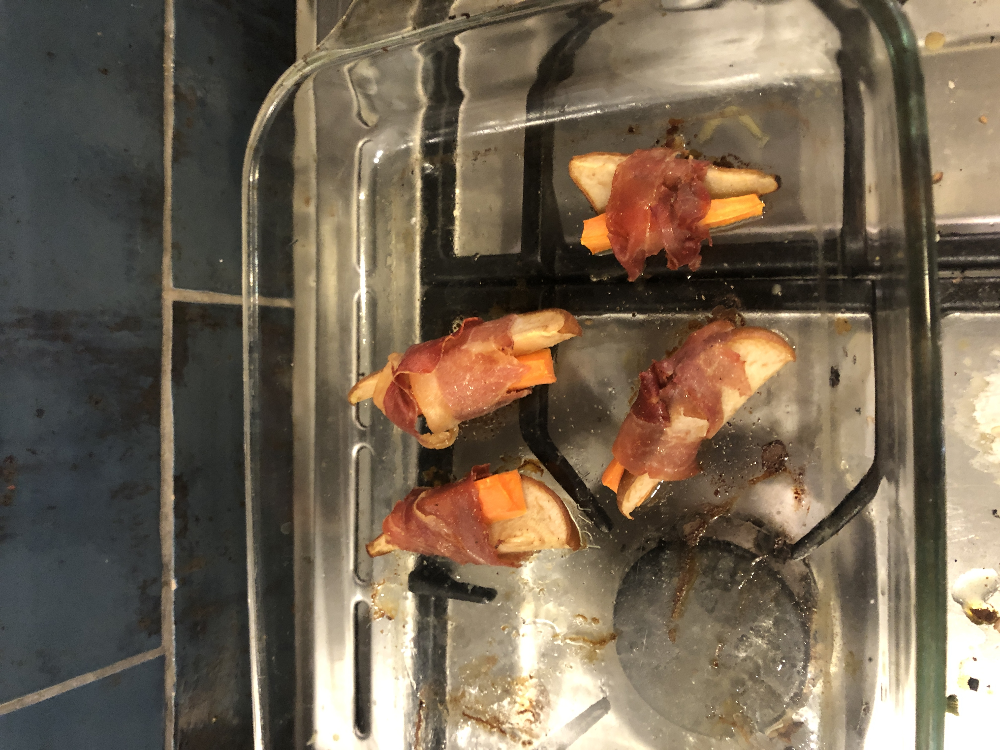
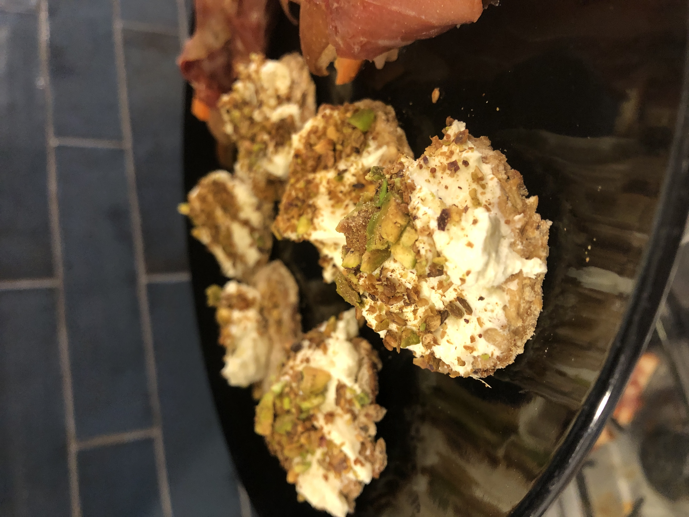
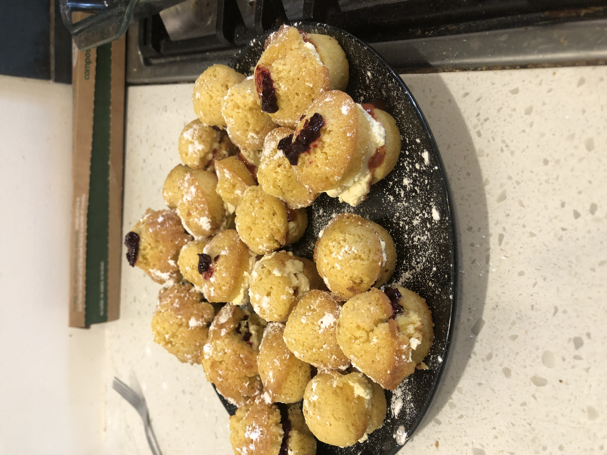
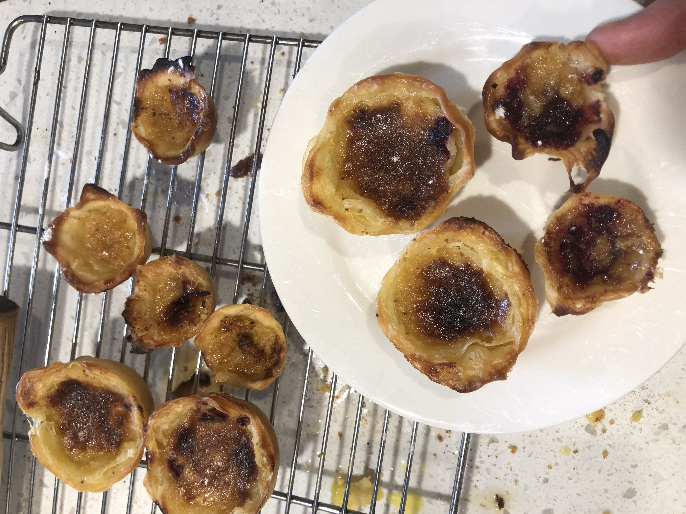

Well after [last month's monstrous](/posts/260707-a-cooking-great-idea/) efforts to make high tea for me and my partner I needed to follow that up with another effort. I am much busier now with life and so wanted things to be simpler and it meant I left all cooking till the day of the event! After 8 hours of cooking I had a kitchen that looks like a bomb went off in it and 3 savoury items and 2 sweet items each (with a large horde of leftovers).

## The rules (again)

The goal is the same—high tea for me and my partner and the rules almost unchanged:

- 3 savoury items
- 2 sweet items
- No repeats from any previous time
- From scratch as much as possible

I think that broadly it was a success!

## The menu

I recently got a mortar and pestle and so wanted to make use of it and so managed to have two things that used it. Next time might have to find a sweet thing that uses it as well. Like last time recipes are mostly from ChatGPT with some tweaks and what not. I can say that broadly the recipes worked (except the carrot and pear wrapped in prosciutto which needs work).

**Savoury**:  
- [Coronation chicken sandwiches](#coronation-chicken-sandwiches)  
- [Carrot & Pear wrapped in prosciutto](#carrot-&-pear-wrapped-in-prosciutto)  
- [Whipped feta and Pistachio Dukkah on Oat and seed crackers](#whipped-feta-and-pistachio-dukkah-on-oat-and-seed-crackers)  

**Sweet**:  
- [Victorian Sponge](#victorian-sponge)  
- [Pasteis de Nata](#pasteis-de-nata)  

## The food

### Coronation chicken sandwiches

A fun little sandwich which is a take on a classic chicken mayo. It has a bit of history though and was created for the [coronation of Queen Elizabeth II](https://en.wikipedia.org/wiki/Coronation_chicken). Funny a recipe having so much history.

The bread that I made to go with it was a bit too enriched for my liking. I was trying to replicate the cheap soft white bread found at supermarkets.

[Coronation chicken recipe](recipes/coronation-chicken-sandwiches.pdf)

### Carrot & Pear wrapped in prosciutto

This one was supposed to be with asparagus but it wasn't available at the shops. So I improvised and the flavours just didn't quite meld together as much as I hoped. It was missing a little salt and something else to pull it together. Maybe should have added honey.

[Carrot and pear wrapped in prosciutto recipe](recipes/carrot-and-pear-wrapped-in-prosciutto.pdf)

### Whipped feta and Pistachio Dukkah on Oat and seed crackers

A simple one but quite good. Need to be wary with toasting properly and not over grinding otherwise you lose the crunch of the dukkah.

[Whipped feta and pistachio dukkah recipe](recipes/whipped-feta-and-pistachio-dukkah.pdf)

The crackers are resilient as I overdid them a touch and were still alright.

[Oat and seed crackers recipe](recipes/oat-and-seed-crackers.pdf)

### Victorian Sponge

Now the standard high tea has scones yet because of rule #3 I can't make scones again and so have to find another way to have cream and jam. These were just the fit.

[Victorian Sponge recipe](recipes/victorian-sponge.pdf)

### Pasteis de Nata

Making croissants last time was fun as I got to experiment with laminated dough and so I wanted to carry on experimenting. My partner is not a fan of Dutch pastries so I went further a field. They turned out quite tasty with more flavour than I was expecting from *just* a "custard tart". My oven door is broken so I couldn't even cook them that hot and yet it still had a good burn and crunch.

[Pasteis de Nata recipe](recipes/pasteis-de-nata.pdf)

## Again?

I still have days of food to eat yet with family around it should be doable.
