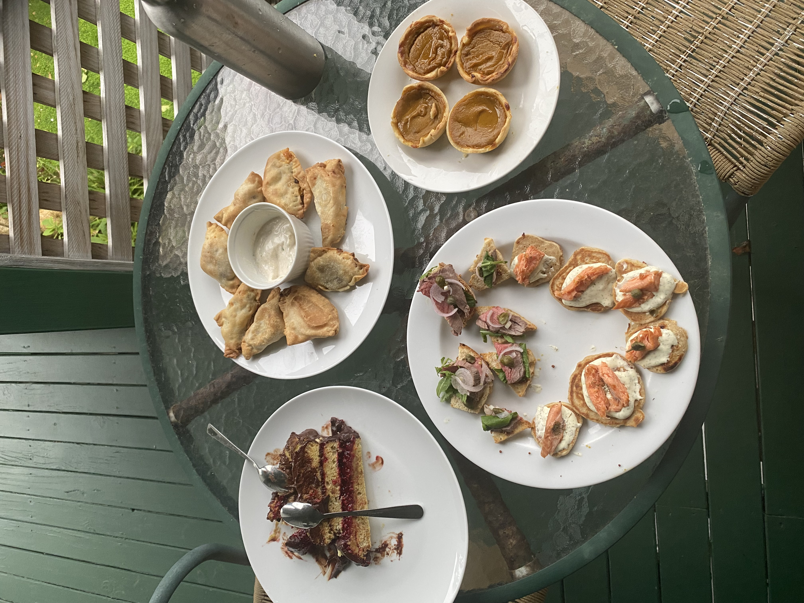
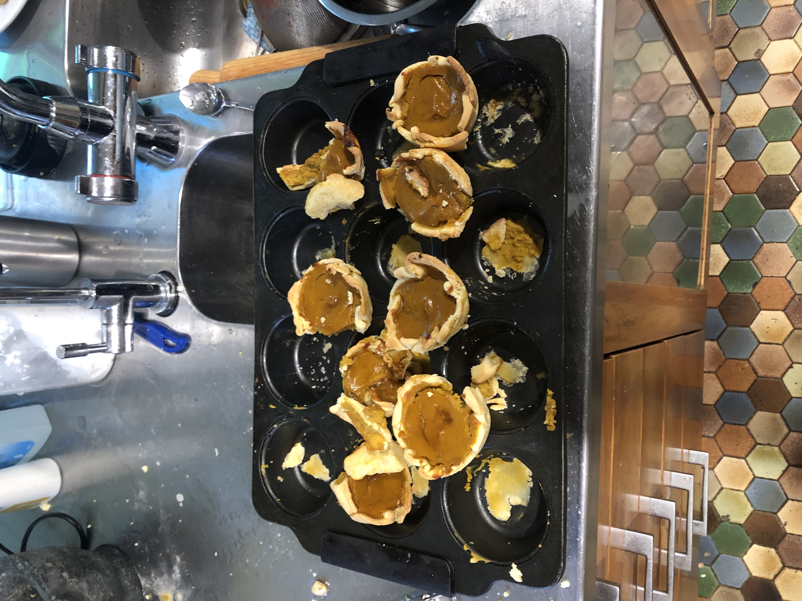
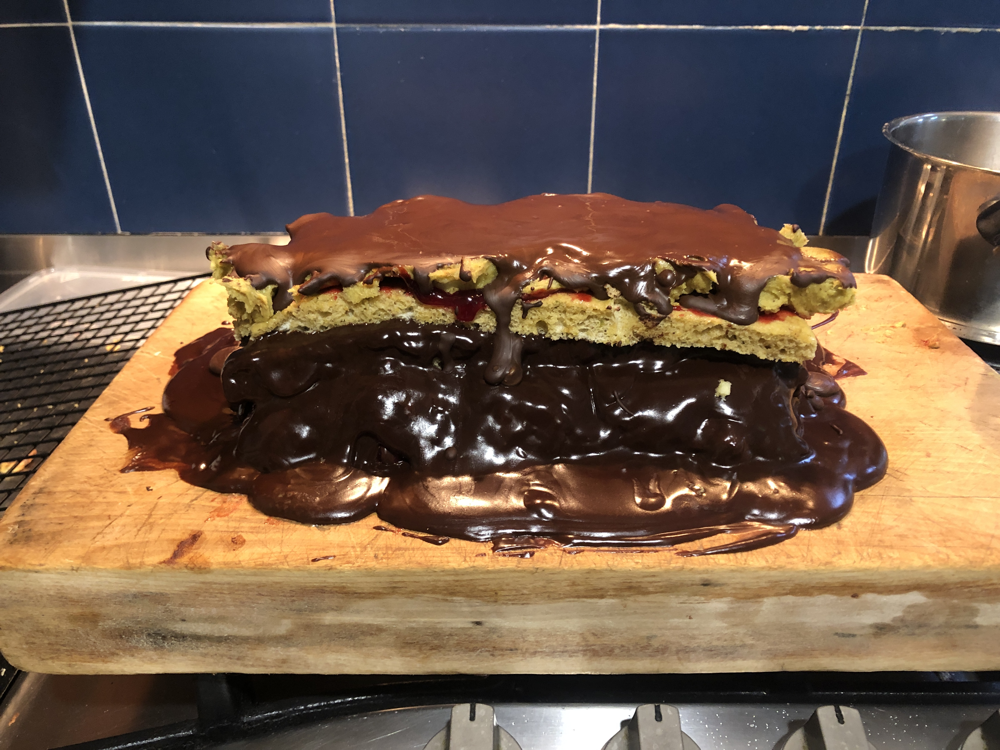

I would have thought that after my [last high tea](../260807-just-keep-on-cooking/) being frantic I would have learnt my lesson. That didn't happen. I once again left most of the cooking to the day of eating. This meant 8 hours of cooking and a delay of 2 hours. In the end though lots of food to eat and new recipes all round. Next month I will have off as it is extra special month. But hopefully in November I will be more onto it and prepare more in advance.

The day is late so I will keep things concise. Sadly as I was so late we forgot to take enough photos so not all recipes have photos. 

## The menu

I was less sure about what to make this time. Each month I just choose things I haven't made before that seem like they would be fun to make. Everything worked mostly alright (except half of the pumpkin pies that got stuck in the dish).

Some things were very quick and easy like Salmon Blinis while other took most of the day like the Opera Cake.

**Savoury**:  
- [Beef Crostini](#beef-crostini)  
- [Salmon & Creme Fraiche on mini Blinis](#salmon-creme-fraiche-on-mini-blinis)  
- [Samosas](#samosas)

**Sweet**:  
- [Mini Pumpkin Pie](#mini-pumpkin-pies)  
- [Pistachio & Raspberry Opera Cake](#pistachio-raspberry-opera-cake)

## The food

### Beef Crostini

After ChatGPT has been suggesting this to me every month I finally decided to cave in. I was initially going to do carpaccio yet my partner wasn't a fan of raw beef. Therefore last minute I changed to this.

Was alright however the bread wasn't exciting as I slightly over toasted it. It would have been better with softer bread and some salt and herbs on the toast.

[Beef Crostini recipe](recipes/beef-crostini.pdf)

### Salmon & Creme Fraiche on mini Blinis

Sometimes the simple things are the best. This was one of those. Blinis take 20 minutes to make and assembling is straight forward. Quite tasty and very fresh feeling.

[Salmon & Creme Fraiche on mini Blinis recipe](recipes/salmon-blinis.pdf)

### Samosas

Growing up sometime the hockey team (or some other random group of people at a school or church or whatever) would have a fundraiser and make Samosas. If they could do it surely I could do it too. They turned out alright with just enough flavour—I mean *just*. However the pastry wasn't quite like store bought as I air fried rather than deep frying.

[Samosa recipe](recipes/samosas.pdf)

### Mini Pumpkin Pies

{width=50%}

Pumpkin pies are a bit of a thing in my little world. A full size pumpkin pie would have been grossly inappropriate for high tea so mini ones were attempted. A few problems namely the filling was a touch too spicy without enough sweetness and half of the pies got stuck in the dish.

[Mini Pumpkin Pie recipe](recipes/mini-pumpkin-pies.pdf)

### Pistachio & Raspberry Opera Cake

This was a beast. I didn't quite know what I was getting myself into and the extra cooling steps when assembling caught me off guard and delayed me by a bit. It worked though and the result looked a lot like Opera cake (once sliced up and plated).

My first attempt at making the sponge with beating egg whites failed as I didn't clean my mixer and so the egg whites never got to stiff peaks. Lesson learned always clean the mixer when beating egg whites.

[Pistachio & Raspberry Opera Cake recipe](recipes/opera-cake.pdf)